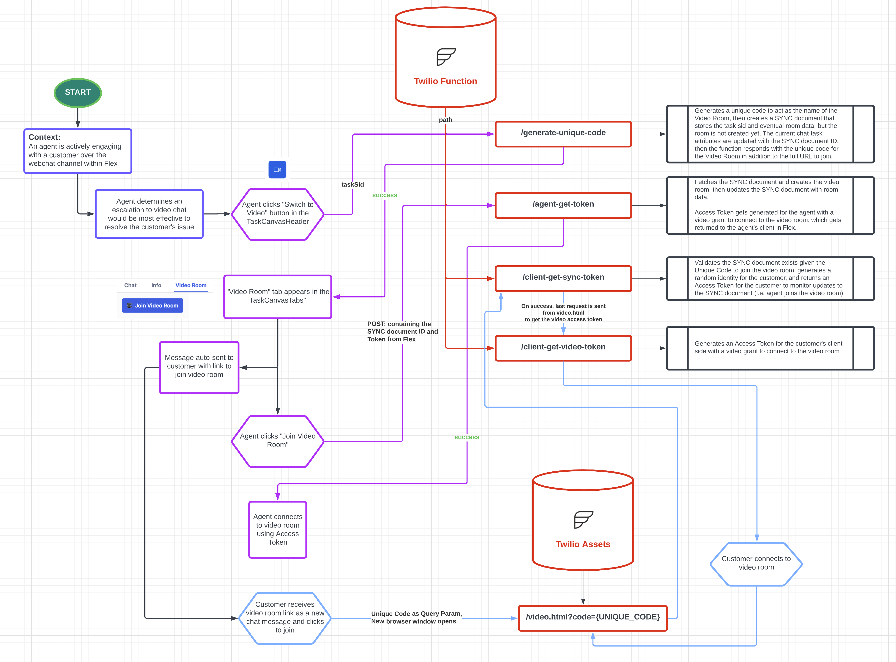
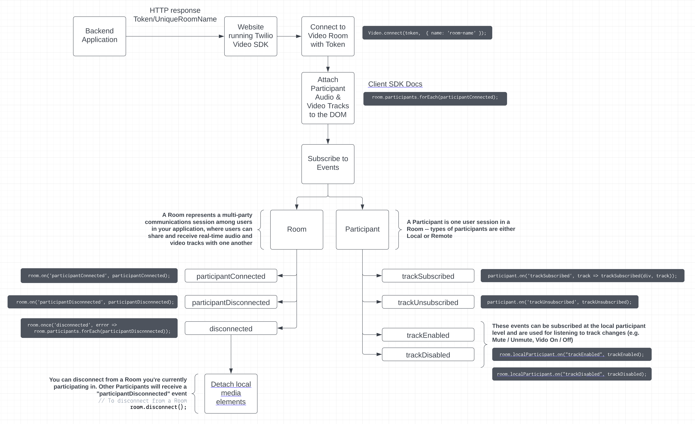

<a  href="https://www.twilio.com">

</a>

# Chat to Video Escalation in Flex Plugin

This Flex Plugin shows how an agent can initiate a video room from a webchat conversation within Flex. This plugin was built for **Flex 2.0**.

---

## Functionality Overview

### Technical Components

- **Twilio Serverless Functions** - used to orchestrate the API requests to generate access tokens
- **Twilio Serverless Assets** - used to host the customer-side video room UI
- **Twilio Sync** - utilized as the source of truth to store information about the video room and requests
- **Twilio Video JS** - used for connecting and monitoring the video rooms on the client side

### Escalating Chat to Video

The following diagram demonstrates how a chat session can be escalated to video. More specifically, this flow outlines the technical details from agent initiation to connecting to the video room.



### Video Room JS SDK Events

The next diagram outlines high-level operations that need to be considered when implementing a video room experience, specifically the different types of events that need to be handled as relating to the Room and Participants.



---

## Setup

### Requirements

To deploy this plugin, you will need:

- An active Twilio account with Flex provisioned. Refer to the [Flex Quickstart](https://www.twilio.com/docs/flex/quickstart/flex-basics#sign-up-for-or-sign-in-to-twilio-and-create-a-new-flex-project") to create one.
- npm version 5.0.0 or later installed (type `npm -v` in your terminal to check)
- Node.js version 14 installed (type `node -v` in your terminal to check)
- [Twilio CLI](https://www.twilio.com/docs/twilio-cli/quickstart#install-twilio-cli) along with the [Flex CLI Plugin](https://github.com/twilio-labs/plugin-flex) and the [Serverless Plugin](https://github.com/twilio-labs/serverless-toolkit/tree/main/packages/plugin-serverless). Run the following commands to install them:
  ```bash
  # Install the Twilio CLI
  npm install twilio-cli -g
  # Install the Serverless and Flex as Plugins
  twilio plugins:install @twilio-labs/plugin-serverless
  twilio plugins:install @twilio-labs/plugin-flex
  ```

### Twilio Account Settings

Before we begin, we need to collect all the config values we need to run this Flex plugin:

| Config&nbsp;Value | Description                                                                                                                          |
| :---------------- | :----------------------------------------------------------------------------------------------------------------------------------- |
| Account&nbsp;Sid  | Your primary Twilio account identifier - find this [in the Console](https://www.twilio.com/console).                                 |
| Auth Token        | Used to create an API key for future CLI access to your Twilio Account - find this [in the Console](https://www.twilio.com/console). |

---

## Local Development

After the above requirements have been met:

1. Clone this repository.

   ```bash
   git clone git@github.com:mschmitt19/plugin-video-in-flex.git
   ```

2. Install dependencies.

   ```bash
   npm install
   ```

3. Rename and create the `appConfig.js` file:

   ```bash
   cd public && cp appConfig.example.js appConfig.js
   ```

4. [Deploy your Twilio Function](#twilio-serverless-deployment).

5. Run the application.

   ```bash
   twilio flex:plugins:start
   ```

6. Navigate to [http://localhost:3000](http://localhost:3000).

### Twilio Serverless deployment

You need to deploy the function associated with the plugin. The function houses multiple routes called from the plugin to aid in token and room creation. For further information on the technical functionality, please review `./functions/functions`.

#### Pre-deployment Steps

1. Change into the functions directory, install package dependencies, and then rename `.env.example`.

   ```bash
   # Install required dependencies
   npm install
   # Rename example env file
   cd functions && cp .env.example .env
   ```

2. Open `.env` with your text editor and set the environment variables mentioned in the file.

   ```
   ACCOUNT_SID=ACxxxxxxxxxxxxxxxxxxxxxxxxxxx
   AUTH_TOKEN=xxxxxxxxxxxxxxxxxxxxxxxxxxx

   TWILIO_API_KEY=SKxxxxxxxxxxxxxxxxxxxxxxxxxxx
   TWILIO_API_SECRET=xxxxxxxxxxxxxxxxxxxxxxxxxxx

   TASKROUTER_WORKSPACE_SID=WSxxxxxxxxxxxxxxxxxxxxxxxxxxx
   TASKROUTER_VIDEO_WORKFLOW_SID=WWxxxxxxxxxxxxxxxxxxxxxxxxxxx

   CODE_LENGTH=7
   CODE_TTL=3600
   SYNC_SERVICE_SID=ISxxx

   VIDEO_ROOM_TYPE=group
   VIDEO_RECORD_BY_DEFAULT=true
   ```

3. Deploy the Twilio function to your account using the Twilio CLI:

   ```bash
   cd functions && twilio serverless:deploy
   # Example Output
   # Deploying functions & assets to the Twilio Runtime
   # ⠇ Creating 1 Functions
   # ✔ Serverless project successfully deployed
   # Deployment Details
   # Domain: https://function-name-xxxx-dev.twil.io
   # Service:
   #    function (ZSxxxx)
   # ..
   ```

4. Copy and save the domain returned when you deploy a function. You will need it in the next step.

If you forget to copy the domain, you can also find it by navigating to [Functions > API](https://www.twilio.com/console/functions/api) in the Twilio Console.

> Debugging Tip: Pass the `-l` or logging flag to review deployment logs.

### Flex Plugin Deployment

Once you have deployed the function, it is time to deploy the plugin to your Flex instance.

You need to modify the source file to mention the serverless domain of the function that you deployed previously.

1. In the main directory rename `.env.example`.

   ```bash
   cp .env.example .env
   ```

2. Open `.env` with your text editor and set the environment variables mentioned in the file.

   ```
   # Paste the Function deployment domain
   REACT_APP_VIDEO_APP_URL=https://xxxxxxx
   ```

3. When you are ready to deploy the plugin, run the following in a command shell:

   ```bash
   twilio flex:plugins:deploy --major --changelog "Initial Agent Video Escalation on Web Chat" --description "Agent Video Escalation"
   ```

### Testing with Web Chat

To test this functionality locally with Flex 2.0, clone the [Twilio Flex Web Chat UI Sample](https://github.com/twilio/flex-webchat-ui-sample) React app.

## View your plugin in the Plugins Dashboard

After running the suggested next step with a meaningful name and description, navigate to the [Plugins Dashboard](https://flex.twilio.com/admin/) to review your recently deployed and released plugin. Confirm that the latest version is enabled for your contact center.

You are all set to test the plugin on your Flex application!

---

## Changelog

### 1.0.0

**August 9, 2022**

- Updated README and pushed code.

## Reference

This plugin was created & inspired by a pre-existing solution located in [this repo](https://github.com/jlbrs/Twilio-Video-in-Twilio-Flex), for reference.

## Disclaimer

This software is to be considered "sample code", a Type B Deliverable, and is delivered "as-is" to the user. Twilio bears no responsibility to support the use or implementation of this software.
